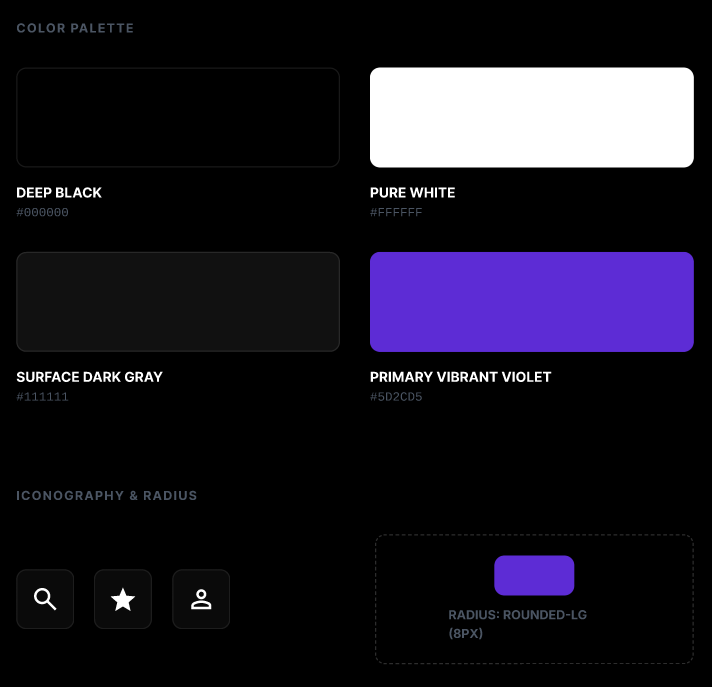
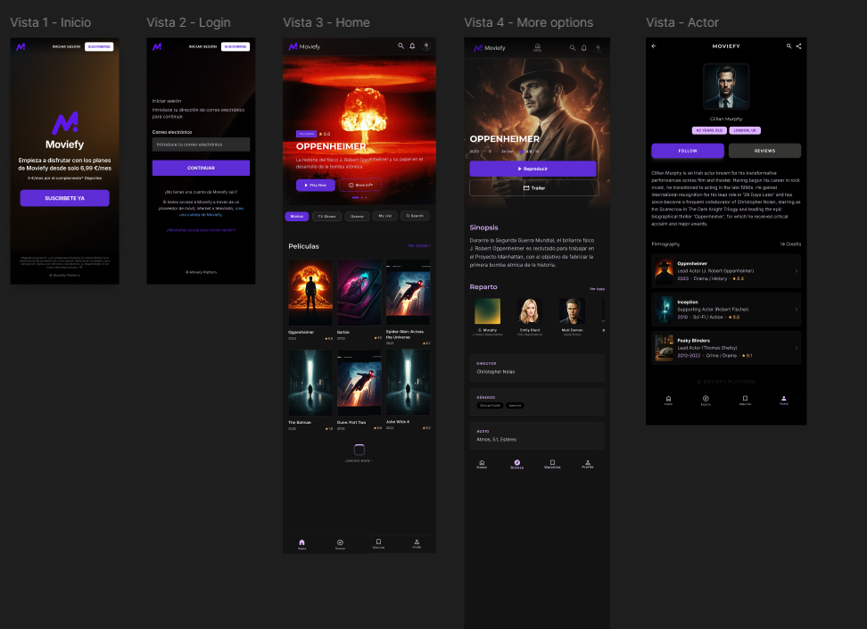
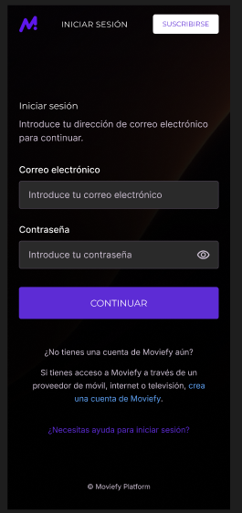

# 🗺️ Plan de trabajo · Moviefy 🎬

> 📋 Plan paso a paso dividido en **6 fases** para construir Moviefy en **2 semanas** de trabajo individual.
> 🎯 Cada fase tiene objetivo, tareas concretas, criterios de "hecho" y estimación de tiempo.

---

## 📅 Vista general

> 💡 **El plan es la visión escalable a Nivel II.** La entrega comprometida del Sprint 1-2 es **Nivel I funcional completo**. Las fases marcadas como 🟡 Nivel II quedan como ampliación opcional con la arquitectura preparada.

| Fase | Nombre | Duración | Sprint | Alcance |
|:---:|---|:---:|:---:|:---:|
| **0️⃣** | 🧱 Cimientos del proyecto | 1 día | Pre-sprint | ✅ Base |
| **1️⃣** | 🔍 Exploración de películas | 3-4 días | Sprint 1 | ✅ Nivel I |
| **2️⃣** | 🔐 Autenticación | 2 días | Sprint 1 | 🟡 Nivel II |
| **3️⃣** | 📄 Fichas detalladas | 2-3 días | Sprint 2 | ✅ Nivel I |
| **4️⃣** | ⭐ Favoritos y puntuaciones | 2 días | Sprint 2 | 🟡 Nivel II |
| **5️⃣** | 🎨 Pulido y despliegue | 1-2 días | Sprint 2 | ✅ Cierre |

> ⏱️ **Total estimado**:
> - Nivel I solo (Fases 0+1+3+5): ~7-10 días → entrega comprometida.
> - Nivel I + II completo (todas las fases): ~11-14 días → ampliación si el tiempo lo permite.

---

## 📐 Material de referencia

🗂️ Recursos visuales y algorítmicos que orientan la implementación. Todos viven versionados en `docs/assets/`.

### 🟣 Logo


✨ Identidad visual del proyecto. Acento **Primary Vibrant Violet** (`#5D2CD5`) que define la paleta general.

### 🎨 Paleta y design tokens



🖌️ **Colores principales:**

- 🖤 **Deep Black** — `#000000` — fondo base de la app.
- ⬛ **Surface Dark Gray** — `#111111` — superficies, cards, inputs, contenedores.
- ⚪ **Pure White** — `#FFFFFF` — textos principales e iconos.
- 🟣 **Primary Vibrant Violet** — `#5D2CD5` — CTA principal, links activos, estados focus.

🔘 **Iconografía**: iconos line-style en blanco (#FFFFFF), simples y planos. Sin sombras, sin gradientes. Mostrados en marco cuadrado (~48px) con padding generoso.

📐 **Radius**: `rounded-lg` = `8px` — usar consistentemente para inputs, botones, cards y modales.

### 📱 Mockups — 5 vistas principales



🎨 Prototipo en Figma (acceso con sesión): https://www.figma.com/proto/aTbK6exWJlROQHZKAbsGrz/Moviefy

Vistas cubiertas:

- 🏠 **Vista 1 — Inicio** (`WelcomePage`)
- 🔑 **Vista 2 — Login** (`LoginPage`) · email + password en una sola pantalla
- 🎬 **Vista 3 — Home** (`ExplorationPage`) · hero + listas + bottom nav
- 🎞️ **Vista 4 — More options** (`MovieDetailPage`) · sinopsis, reparto y director en una sola página
- 🎭 **Vista — Actor** (`ActorDetailPage`) · bio + filmografía

📐 Diseño **mobile-first** con tema oscuro y acento morado.

> 📝 **Pendiente en Figma**: añadir el frame de `SignupPage` (mismo layout que LoginPage + campo de confirmación de password). La Vista 2 actual sirve solo para login.

### 🔑 Mockup detallado · LoginPage



🎯 Detalle de la Vista 2:

- 🔝 Header con tabs **"Iniciar sesión"** (activo) · **"Suscribirse"** (link a `/signup`)
- 📧 Input de correo electrónico
- 🔒 Input de contraseña con icono 👁️ para mostrar/ocultar
- 🟣 Botón **"Continuar"**
- 🔗 Link "crea una cuenta de Moviefy" → `/signup`
- 🆘 Link "¿Necesitas ayuda para iniciar sesión?"

### 🗺️ Artefactos de UX y algoritmo

🔗 Los flowcharts y el user flow tienen su **sección propia en Notion** con la explicación detallada de cada uno. Aquí solo se mencionan:

- 🗺️ **User flow — Navegación general** → `docs/assets/user-flow-navegacion.png`
- 🔐 **Flowchart — Autenticación** (login + signup) → `docs/assets/flowchart-autenticacion.svg`
- 🔎 **Flowchart — Buscador** (debounce + reseteo de paginación) → pendiente de exportar
- ♾️ **Flowchart — Scroll infinito** → pendiente de exportar
- ⭐ **Flowchart — Favoritos** (toggle + rating + eliminar) → pendiente de exportar

> 📖 Ver detalle de cada uno en la sección **"Flowcharts y user flow"** del Notion.

---

## 🧱 Fase 0 — Cimientos del proyecto

> 🎯 Dejar las bases técnicas listas para que cada feature posterior sea un commit limpio.

⏱️ **Duración estimada**: 1 día
🏁 **Sprint**: Pre-sprint

### 🛠️ Tareas

1. 📦 **Crear repositorio en GitHub** — público, con descripción del proyecto.
2. ⚛️ **Inicializar proyecto React + Vite** con plantilla `react` (JavaScript).
3. 📁 **Estructura de carpetas** (se siembra a medida que aparecen los primeros componentes/servicios, no preventivamente):
   ```
   src/
   ├── components/   # un folder por componente: <Name>/<Name>.jsx
   ├── pages/        # un folder por página: <Page>/<Page>.jsx
   ├── services/
   ├── hooks/
   ├── context/
   ├── constants/    # urls.js, content.js (theme.js se añade cuando aparezca un token lógico real)
   └── routes/
   ```
4. 📥 **Instalar dependencias** principales:
   - 🛣️ `react-router-dom` → enrutado
   - 🎨 `tailwindcss` + plugin de Vite → estilos
   - 🧪 `vitest`, `@testing-library/react`, `@testing-library/jest-dom`, `jsdom` → testing
5. 🦴 **Esqueletos de servicios vacíos**: crear `services/tmdb.js`, `services/auth.js`, `services/favorites.js` con exports placeholder. Sin lógica todavía.
6. 🎨 **Configurar Tailwind v4** con paleta oficial del proyecto:
   - 🟣 **Tokens en `src/index.css` bajo `@theme`** (Tailwind v4 ya no usa `tailwind.config.js`):
     - `--color-primary` → `#5D2CD5` (Primary Vibrant Violet)
     - `--color-background` → `#000000` (Deep Black)
     - `--color-surface` → `#111111` (Surface Dark Gray)
     - `--color-text` → `#FFFFFF` (Pure White)
     - El namespace `--color-*` dentro de `@theme` genera automáticamente las utilities `bg-primary`, `text-text`, `border-primary`, etc., y expone cada token como variable CSS global en `:root`.
   - 📐 **Radio**: estandarizar en `rounded-lg` (= 8px por defecto en Tailwind v4). Evitar el bare `rounded` (≈4px).
   - 🌑 Tema oscuro por defecto (`color-scheme: dark` en `:root`, sin toggle).
   - 📝 `@import "tailwindcss"` al inicio de `index.css`, primer estilo de prueba con `bg-primary` aplicado.
7. 📝 **`src/constants/content.js`** con la estructura de textos UI (welcome, login, signup, home, errores). 📜 Briefing exige config central de textos — todos los strings de UI viven aquí, agrupados por feature (`content.welcome.*`, `content.login.*`, etc.).
8. 🧪 **Configurar Vitest**: archivo de setup, scripts en `package.json`, primer test que pase.
9. 🛣️ **Configurar React Router**: `BrowserRouter`, una ruta dummy.
10. 🔐 **Variables de entorno**: `.env` con `VITE_TMDB_API_KEY`, `.env.example` versionable.
11. 🔑 **Obtener API Key de TMDB** y guardarla local.
12. 🌿 **Ramas Git**: crear `develop` a partir de `main`.
13. 📖 **README.md inicial** con descripción, requisitos e instalación local.
14. 🚀 **Primer commit + push** a `main` y `develop`.

### ✅ Criterio de hecho

- [ ] ⚡ `pnpm dev` arranca la app en `http://localhost:5173`.
- [ ] 🧪 `pnpm test` ejecuta al menos un test que pasa.
- [ ] 📦 `pnpm build` genera `dist/` sin errores.
- [ ] 🟣 El color `#5D2CD5` se aplica vía clase Tailwind `bg-primary` y el fondo `#000000` con `bg-background`.
- [ ] 📝 `src/constants/content.js` exporta al menos las claves de welcome, login y signup.
- [ ] 🚀 El repo público existe con README, `develop` y commit inicial.

---

## 🔍 Fase 1 — Exploración de películas

> 🎯 El corazón de la aplicación: ver el catálogo, buscar y filtrar.

⏱️ **Duración estimada**: 3-4 días
🏁 **Sprint**: Sprint 1

### 🛠️ Tareas

#### 🧰 Servicio de API

1. **`services/tmdb.js`** — punto único de consumo:
   - 🔥 `getPopularMovies(page)` → listado paginado
   - 🔎 `searchMovies(query, page)` → búsqueda con paginación
   - 🎛️ `getMoviesByFilters({ genre, minRating, sort }, page)` → filtros
   - 🏷️ `getGenres()` → catálogo de géneros para el menú
   - 🔄 Transformación de respuesta cruda → modelo interno (`{ id, title, poster, year, rating, overview }`).
   - ⚠️ Manejo de errores y timeouts.

#### 🧱 Layout base

2. **`App.jsx`** con `BrowserRouter`, layout principal y outlet de rutas.
3. 📲 **`components/Layout/Nav`** responsive:
   - 📱 **Móvil (`md:hidden`)**: bottom nav fija con iconos para Inicio · Exploración · Favoritas · Perfil.
   - 💻 **Desktop (`hidden md:flex`)**: top nav con logo a la izquierda y enlaces a la derecha.
   - ✨ Estado activo claramente diferenciado.

#### 🗂️ Pantalla de exploración (Home)

4. **`pages/ExplorationPage`** que orquesta búsqueda, filtros y listado. Ruta `/home`.
5. 🟦 **`components/movies/MovieGrid`** — rejilla responsive (1 col móvil, 4-5 cols desktop).
6. 🎬 **`components/movies/MovieCard`** — título, póster, año, puntuación. Imagen por defecto si falta póster.

#### 🔎 Buscador

7. **`components/movies/SearchBar`** con input controlado.
8. ⏳ **`hooks/useDebounce`** para retrasar la petición ~300 ms.
9. 🔄 Reseteo de paginación al cambiar la búsqueda.

#### 🎛️ Filtros

10. **`components/movies/FilterMenu`** con género, puntuación mínima y tendencia.
11. 🟢 Indicador visual de filtros activos + botón "Limpiar filtros".

#### ♾️ Scroll infinito

12. **`hooks/useInfiniteScroll`** con `IntersectionObserver` sobre sentinel al final del listado.
13. 🔁 Deduplicación de IDs al cargar páginas adicionales.
14. 📍 Mantenimiento de la posición del scroll al añadir resultados.

#### 🎨 Estados de UX

15. ⏳ **`components/atoms/Spinner`**, 📭 **`EmptyState`**, ⚠️ **`ErrorState`** con botón de reintento.
16. 🎯 Diferenciación visual entre carga inicial (centrada) y carga incremental (al final del listado).

#### 🎬 Pantalla de bienvenida

17. **`pages/WelcomePage`** (ruta `/`) con título, descripción breve y CTA **"Comenzar"** que navega a `/login`. El copy "Suscríbete ya · 6,99€/mes" del Figma se sustituye por algo neutro tipo "Crea tu cuenta gratis para descubrir películas". Se hace al final de la fase porque depende de que Home (y luego Login en Fase 2) existan.

#### 🧪 Testing

18. Tests del servicio con `fetch` mockeado.
19. Tests de `useDebounce`, `useInfiniteScroll`.
20. Tests de `MovieCard`, `SearchBar`, `EmptyState`, `ErrorState`.

### ✅ Criterio de hecho

- [ ] 🎬 Al entrar a `/home` se ven películas populares.
- [ ] 🔎 El buscador filtra resultados sin saturar la API.
- [ ] 🎛️ Los filtros funcionan en aislado y combinados con la búsqueda.
- [ ] ♾️ El scroll infinito carga más sin perder la posición.
- [ ] 🎨 Los 4 estados (loading, vacío, fin, error) son claramente distinguibles.
- [ ] 📲 La nav se ve abajo en móvil y arriba en desktop.
- [ ] 🧪 Todos los `Scenario` Gherkin de la Épica 1 tienen al menos un test.

---

## 🔐 Fase 2 — Autenticación

> 🎯 Login y signup como rutas separadas (patrón Netflix-style). Protege todas las rutas privadas con `ProtectedRoute`.

⏱️ **Duración estimada**: 2 días
🏁 **Sprint**: Sprint 1

### 🛠️ Tareas

#### 🧰 Servicio de autenticación

1. **`services/auth.js`** con:
   - 📧 `validateEmailFormat(email)` → bool con regex de email.
   - 🔢 `validatePasswordRules(password)` → bool, mínimo 8 caracteres.
   - 🔐 `hashPassword(plain)` → string hex via `crypto.subtle.digest('SHA-256', ...)`.
   - 🔎 `emailExists(email)` → bool, consulta `localStorage` clave `moviefy_users`.
   - ✍️ `signup(email, password)` → guarda `{ email, passwordHash }`, abre sesión. ❌ Lanza error si el email ya existe.
   - 🚪 `login(email, password)` → hashea y compara con el guardado. Si coincide abre sesión; si no, devuelve error genérico.
   - 👋 `logout()` → limpia `moviefy_session`.
   - 👤 `getCurrentUser()` → lee `moviefy_session`.
   - 🚫 **Nunca** guardar contraseñas en texto plano. El servicio está diseñado para sustituir el almacén por Firebase/Supabase sin tocar componentes.

#### 🪝 Hook y contexto

2. **`context/AuthContext`** + **`hooks/useAuth`** que expone `{ user, signup, login, logout, emailExists }` a toda la app.

#### 🛡️ Guard de rutas

3. **`components/ProtectedRoute`** que envuelve rutas privadas. Sin sesión → `<Navigate to="/login" replace />`.

#### 🚪 Pantalla LoginPage (Vista 2 del Figma)

4. **`pages/LoginPage`** en ruta `/login`:
   - 🔝 Header con tabs/switch: **"Iniciar sesión"** (activo) · **"Suscribirse"** (link a `/signup`).
   - 📧 Input email.
   - 🔒 Input password con icono 👁️ para mostrar/ocultar.
   - 🟣 Botón **"Continuar"** → llama a `login(email, password)`.
   - ⚠️ Si falla → mensaje genérico **"Credenciales incorrectas"** (no revelar si es email o password).
   - ✅ Si OK → redirect a `/home`.
   - 🔗 Link "crea una cuenta de Moviefy" → navega a `/signup`.
   - 🆘 Link "¿Necesitas ayuda para iniciar sesión?" → modal placeholder.

#### ✍️ Pantalla SignupPage

5. **`pages/SignupPage`** en ruta `/signup`:
   - 🔝 Header con tabs/switch: **"Suscribirse"** (activo) · **"Iniciar sesión"** (link a `/login`).
   - 📧 Input email.
   - 🔒 Input password con icono 👁️.
   - 🔒 Input confirmar password con icono 👁️.
   - 🟣 Botón **"Crear cuenta"** → valida reglas, compara contraseñas, llama a `signup(email, password)`.
   - ⚠️ Si email ya existe → "Esta cuenta ya está registrada. Inicia sesión."
   - ⚠️ Si reglas de password fallan → mensaje específico (longitud / no coinciden).
   - ✅ Si OK → redirect a `/home`.
   - 📝 Nota Figma: el frame del Signup está pendiente — usar misma estructura visual que Login añadiendo el campo de confirmación.

#### 🔄 Redirecciones

6. **`WelcomePage`** (creada en Fase 1) — el CTA "Comenzar" navega a `/login`.
7. 🔀 Si hay sesión activa y se accede a `/login` o `/signup` → redirect automático a `/home`.

#### 🧪 Testing (Gherkin)

8. 📧 Escenario "Login con email inválido" → muestra error, no envía.
9. 📧 Escenario "Login con email vacío" → muestra error.
10. 🔒 Escenario "Login con password incorrecto" → "Credenciales incorrectas".
11. ✅ Escenario "Login válido" → abre sesión y redirige a `/home`.
12. 📧 Escenario "Signup con email inválido" → muestra error.
13. 🔢 Escenario "Signup con password < 8 caracteres" → error.
14. 🔁 Escenario "Signup con passwords que no coinciden" → error.
15. 🚫 Escenario "Signup con email ya registrado" → "Esta cuenta ya está registrada".
16. ✍️ Escenario "Signup válido" → crea cuenta, abre sesión, redirige a `/home`.
17. 🛡️ Escenario "Acceder a ruta protegida sin sesión" → redirige a `/login`.
18. 👋 Escenario "Logout" → limpia sesión y vuelve a `/login`.

### ✅ Criterio de hecho

- [ ] 🛡️ Sin sesión, ninguna ruta protegida es accesible (incluido refresh directo).
- [ ] 🔄 La sesión persiste tras recargar.
- [ ] 👋 Logout limpia completamente la sesión.
- [ ] 🔒 Las contraseñas no aparecen en plano en `localStorage` (verificar abriendo DevTools).
- [ ] 📧 Email con regex inválido nunca crea cuenta.
- [ ] ⚠️ Los mensajes de error en login no revelan si el problema es el email o la contraseña.
- [ ] 🧪 Los 11 escenarios Gherkin de autenticación tienen test.

---

## 📄 Fase 3 — Fichas detalladas

> 🎯 Profundizar en cada entidad y conectar el descubrimiento.

⏱️ **Duración estimada**: 2-3 días
🏁 **Sprint**: Sprint 2

### 🛠️ Tareas

#### 🛣️ Rutas dinámicas

1. **`routes/index.jsx`** con definición centralizada y protección:
   ```
   /                 → WelcomePage              [público]
   /login            → LoginPage                [público, redirige a /home si hay sesión]
   /signup           → SignupPage               [público, redirige a /home si hay sesión]
   /home             → ExplorationPage          [protegida]
   /movies/:id       → MovieDetailPage          [protegida]
   /actors/:id       → ActorDetailPage          [protegida]
   /directors/:id    → DirectorDetailPage       [protegida]
   /favorites        → FavoritesPage            [protegida]
   *                 → NotFoundPage
   ```
2. 🔗 Navegación interna con `<Link to="..." />`. Nada de `<a>` puros.
3. 🛡️ Las rutas marcadas como `[protegida]` se envuelven con `<ProtectedRoute>`.

#### 🧰 Ampliación del servicio TMDB

4. 🎬 **`getMovieDetail(id)`** → sinopsis, reparto, director, fecha, tráiler.
5. 🎭 **`getPersonDetail(id)`** → datos del actor o director, filmografía.
6. 🔄 Transformación a modelo interno consistente.

#### 🎬 Fichas

7. **`pages/MovieDetailPage`** con:
   - 🖼️ Cabecera: póster + título + año + puntuación
   - 📖 Sinopsis
   - 🎭 Carrusel de reparto (clic → ficha actor)
   - 🎬 Director/a (clic → ficha director)
   - ▶️ Tráiler embebido si está disponible
8. 🎭 **`pages/ActorDetailPage`** con foto, nombre, nacionalidad, filmografía.
9. 🎬 **`pages/DirectorDetailPage`** con foto, nombre, nacionalidad, películas dirigidas.

#### ⚠️ Estados

10. ⏳ Estado de carga al entrar en cada ficha.
11. 🔍 **`pages/NotFoundPage`** para rutas inválidas o entidades inexistentes.
12. 🔄 Mensaje de error con reintento si el servicio falla.

#### 🧪 Testing

13. Tests de cada página de detalle (mockeando el servicio).
14. Tests de navegación entre entidades.
15. Tests de `ProtectedRoute` (con sesión y sin sesión).

### ✅ Criterio de hecho

- [ ] 🔗 Cada película, actor y director tienen URL única (`/movies/:id`, etc.).
- [ ] 🔄 Acceder a la URL directamente (refresh / paste) carga la entidad correcta.
- [ ] 🎬➡️🎭 Desde una película puedes ir a un actor y desde ahí a otra película.
- [ ] 🔍 Una URL inválida muestra `NotFoundPage`.
- [ ] 🛡️ Sin sesión, abrir directamente `/movies/123` redirige a `/login`.
- [ ] 🧪 Todos los `Scenario` Gherkin de la Épica 2 tienen al menos un test.

---

## ⭐ Fase 4 — Favoritos y puntuaciones

> 🎯 El toque personal: cada usuaria construye su propio ranking.

⏱️ **Duración estimada**: 2 días
🏁 **Sprint**: Sprint 2

### 🛠️ Tareas

#### 💾 Persistencia

1. **`services/favorites.js`** que abstrae `localStorage` con la clave `moviefy_favorites_<email>` para que cada cuenta tenga sus propios favoritos:
   - 📋 `getFavorites()` → `Array<{ id, rating? }>`
   - ➕ `addFavorite(movie)`
   - ❌ `removeFavorite(id)`
   - ⭐ `setRating(id, rating)` con validación 1-10
   - ❓ `isFavorite(id)`

#### 🪝 Hook

2. ⚓ **`hooks/useFavorites`** que expone el estado y mantiene sincronía con `localStorage` y con un Context global.
3. 🌐 **`context/FavoritesContext`** para reflejar cambios en toda la app sin pasar props.

#### 🧩 UI

4. ⭐ **`components/atoms/FavoriteToggle`** — botón estrella vacía/llena.
5. 🔢 **`components/atoms/Rating`** — selector 1-10 con validación.
6. 🔗 Integración del toggle en `MovieCard` y en `MovieDetailPage`.

#### 📋 Página de favoritas

7. **`pages/FavoritesPage`** con:
   - 🟦 Listado con cards (reutilizando `MovieCard`)
   - ⭐ Puntuación personal visible en cada card
   - ✏️ Botón para editar puntuación
   - 🗑️ Botón para eliminar de favoritas
   - 📭 Estado vacío informativo

#### 🧪 Testing

8. Tests del servicio de localStorage.
9. Tests de `useFavorites` y del contexto.
10. Tests de `FavoriteToggle`, `Rating`, `FavoritesPage`.

### ✅ Criterio de hecho

- [ ] 💾 El toggle de favorito persiste tras recargar.
- [ ] 🔢 Las puntuaciones solo admiten 1-10.
- [ ] 🔄 Cambios en una vista se reflejan en todas las demás (consistencia).
- [ ] 📭 La página de favoritas muestra estado vacío si no hay nada.
- [ ] 👥 Cada cuenta tiene su propia lista (cambiar de usuario muestra favoritos distintos).
- [ ] 🧪 Todos los `Scenario` Gherkin de la Épica 3 tienen al menos un test.

---

## 🎨 Fase 5 — Pulido y despliegue

> 🎯 Lo último 10% que hace que el proyecto se entregue bien.

⏱️ **Duración estimada**: 1-2 días
🏁 **Sprint**: Sprint 2

### 🛠️ Tareas

#### 🎨 Diseño y UX

1. 🔍 Revisión visual contra los mockups en móvil (~375px) y escritorio (~1280px).
2. 🎚️ Ajustes de contraste, espaciado, tipografía.
3. 🖱️ Estados de hover, focus y disabled en todos los elementos interactivos.
4. ♿ Accesibilidad: `alt` en todas las imágenes, labels en formularios, navegación por teclado.

#### 🌐 Cross-browser

5. 🧭 Pruebas en Chrome, Firefox, Safari y Edge.
6. 🔧 Corrección de cualquier diferencia visible.

#### ⚡ Optimización

7. 🧠 `useMemo` en derivaciones costosas de listas filtradas.
8. 🖼️ Lazy loading de imágenes (atributo `loading="lazy"`).
9. ⚠️ Verificar que no hay warnings de React en consola.

#### 📦 Despliegue

10. 🌍 Elegir plataforma (recomendado: **Netlify** por simplicidad).
11. 🔐 Configurar variable de entorno `VITE_TMDB_API_KEY` en la plataforma.
12. 🛣️ Configurar redirección SPA (`/*` → `/index.html`) para que las rutas dinámicas funcionen tras refresh.
13. 🚀 Despliegue y verificación.

#### 📚 Documentación final

14. 📖 **README.md** completo:
    - 📝 Descripción del proyecto
    - 📸 Capturas o GIF de la app
    - 🧱 Stack y dependencias
    - 🔧 Instalación local (`pnpm install`, `pnpm dev`)
    - 🔑 Variables de entorno necesarias
    - 🌐 Enlace al deploy
    - 📁 Estructura del proyecto
    - 🔒 Nota sobre auth: fake-auth localStorage con hashing SHA-256, swappable a Firebase Auth.
15. 📊 **Artefactos de diseño y algoritmo**:
    - 🗺️ User flow general (ya existe).
    - 🔐 Flowchart de autenticación (ya existe).
    - 🔎 Flowchart de algoritmo del buscador (debounce + reseteo de paginación).
    - ♾️ Flowchart de algoritmo del scroll infinito.
    - ⭐ Flowchart de algoritmo de favoritos.
16. 📋 **Product backlog** con estimaciones (puede vivir en Notion).
17. 🎨 **Mockups** organizados en Figma (incluyendo SignupPage que está pendiente).
18. 🎨 **Design System** documentado (paleta, tipografía, espaciados, componentes atómicos).

#### 🎤 Presentación

19. 📝 Preparar guion de 10 minutos:
    - 🎬 3 min · Demo funcional en vivo
    - 📊 2 min · Gestión del proyecto (Kanban, backlog, retos)
    - 💻 5 min · Recorrido por el código

### ✅ Criterio de hecho

- [ ] 🌐 La app está desplegada y funcionando online.
- [ ] 🔄 Las rutas dinámicas funcionan tras refresh en producción.
- [ ] 📖 El README permite a cualquier persona clonar y arrancar el proyecto.
- [ ] 📚 Toda la documentación está enlazada en la ficha de proyecto de Notion.
- [ ] 🎤 Presentación ensayada en su duración objetivo.

---

## 🚀 Buenas prácticas durante todo el proyecto

### 🌿 Git Flow

```
main          ← 🏷️  versiones estables (deploy)
develop       ← 🔀  integración
feature/*     ← 🛠️  trabajo por feature
```

### 📝 Convención de commits

```
<verbo-infinitivo>: <qué cambia y por qué>
```

Ejemplos:

- ✨ `Añadir buscador en tiempo real con debounce de 300ms para evitar peticiones excesivas`
- 🐛 `Corregir reseteo de paginación al cambiar de filtro`
- ♻️ `Refactorizar servicio TMDB para devolver modelo interno consistente`
- 🔐 `Añadir hashing SHA-256 en services/auth.js para no guardar passwords en plano`

### 📅 Frecuencia

- 🧩 Commits **pequeños y atómicos** — uno por unidad lógica de trabajo.
- 📤 Push a `develop` al menos una vez al día.
- 🚀 Merge a `main` solo al final de cada sprint o antes de un deploy.

---

## ⚠️ Riesgos y mitigaciones

| 🚨 Riesgo | 🛡️ Mitigación |
|---|---|
| 🔥 **Auth real con BaaS exigida por la mentora** | `services/auth.js` diseñado swappable: la fake-auth con localStorage se sustituye por Firebase Auth sin tocar componentes ni hooks. La interfaz pública del servicio queda igual. |
| 🔒 **`crypto.subtle` no disponible** (solo funciona en contextos seguros) | En `localhost` y HTTPS funciona. Si la mentora pide demo en contexto inseguro, fallback a SHA-256 en JS puro o documentar la limitación. |
| 🚫 **API key TMDB bloqueada** | Tener OMDb como fallback documentado. |
| 🧪 **Bloqueo en testing** | Empezar tests sencillos pronto, no acumular para el final. |
| 🎨 **Diseño tarde / SignupPage sin mockup** | Crear el frame de SignupPage en Figma antes de empezar Fase 2 (puede ser low-fi). |
| 🌪️ **Atascarse en Tailwind** | Limitar la primera ronda a estilos funcionales; pulir al final. |

---

## 📌 Próxima acción

➡️ **Validar este plan con la mentora y arrancar la Fase 0** 🚀
